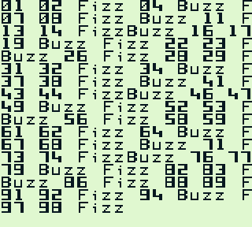
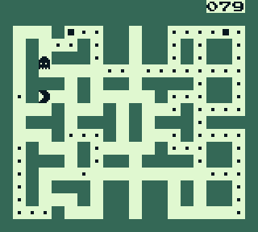
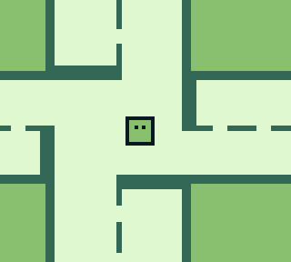
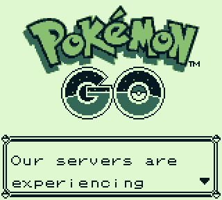
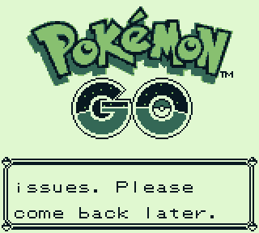

## gbdev

Some Game Boy software developed in Assembly.

Compile with [rgbds](https://github.com/rednex/rgbds)

```sh
rgbasm -o main.o main.asm
rgblink -o main.gb main.o 
rgbfix -v -p 0 main.gb
```

Run the produced ROM with an emulator like BGB or Gambatte.

### fizzbuzz



### kupman



### moving



### pokemon go


